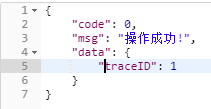
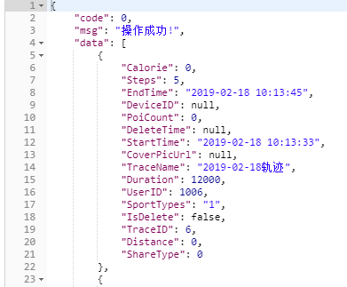
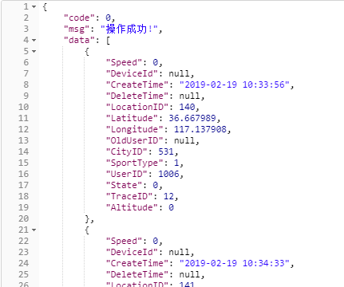
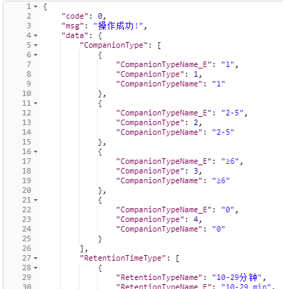
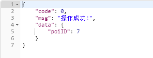
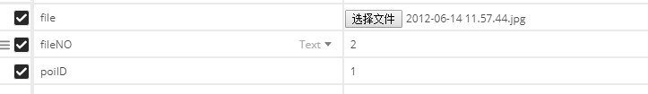
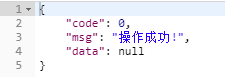
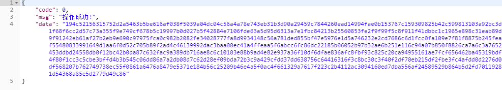
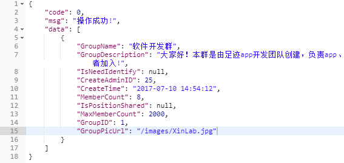
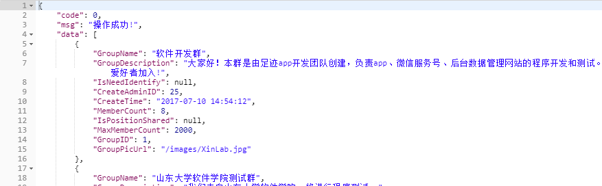

**一、注册登录**

**1、发送验证码：/user/sendSMSCode**

参数：

mobilePhone：

返回：

0：成功

12：手机号格式不正确,请使用中国大陆运营商正确手机号码!

13：手机验证码发送失败,请稍后再试!

1.  **注册接口：/user/register**

参数：

loginName：

password：

code:

返回：

0：成功

14：手机验证码超时已失效,请重新获取!

15：手机验证码不正确,请重新输入!

16：该手机号已经注册过,请直接登录!

**3、登录接口：/user/login**

参数：

loginName：

password：

返回：

0：登录成功

200：该用户名不存在或已停用!

201：密码错误,请重新登录!

**4、退出登录接口：/user/logout**

参数：

token：

返回：

0：成功

**二、轨迹相关**

1.  **开始一条轨迹：/trace/startTrace**

参数：

token:

tracename:

starttime:

sporttypes:

返回：

0：操作成功

100：缺少token参数或为空!

101：token已过期!请重新登录!

1.  **结束一条轨迹：/trace/endTrace**

参数：

token:

traceinfo：

{"TraceID":1,"EndTime":"2017-07-07
22:27:16","Duration":100,"Distance":100,"Steps":200}

返回：

0：操作成功

100：缺少token参数或为空!

101：token已过期!请重新登录!

1.  **上传位置点：/location/uploadLocation**

参数：

token:

locations:

[{}]

返回：

0：操作成功

100：缺少token参数或为空!

101：token已过期!请重新登录!

1.  **分页获取当前登录用户的所有轨迹列表：/trace/getTraceList**

参数：

token:

pageIndex:页码

pageSize：每页的大小

返回：

0：操作成功

100：缺少token参数或为空!

101：token已过期!请重新登录!

1.  **删除一条轨迹：/trace/deleteTrace**

参数：

token:

traceID：

返回：

0：操作成功

100：缺少token参数或为空!

101：token已过期!请重新登录!

1.  **获取轨迹位置点详情：/location/getTraceLocation**

参数：

token:

traceID：

返回：

0：操作成功

100：缺少token参数或为空!

101：token已过期!请重新登录!

**7、安卓端存在本地的多条轨迹信息上传：/trace/uploadTrace**  
  
参数：  
token:  
traceinfo：  
[{"EndTime":"2017-07-07 22:27:16","Duration":100,"Distance":100,"Steps":200},  
{"EndTime":"2017-07-07 22:27:16","Duration":100,"Distance":100,"Steps":200},  
{"EndTime":"2017-07-07 22:27:16","Duration":100,"Distance":100,"Steps":200}]  
  
返回：  
0：操作成功  
100：缺少token参数或为空!  
101：token已过期!请重新登录!

1.  **兴趣点相关**

**1、获取兴趣点选项：/poi/getPoiChoices**

参数：

token:

返回：

0：操作成功

100：缺少token参数或为空!

101：token已过期!请重新登录!

1.  **上传兴趣点文字信息：/poi/uploadPoi**

参数：

token:

tracePoi:{"UserID":1008,"TraceID":2,"PoiNo":1,"Comment":"哈哈哈"}

返回：

0：操作成功

100：缺少token参数或为空!

101：token已过期!请重新登录!

1.  **上传兴趣点文件（图片或视频，一次只能上传一个文件）：/poi/uploadFile**

参数：

token:

poiID:

file:

fileNO:

返回：

0：操作成功

100：缺少token参数或为空!

101：token已过期!请重新登录!

400：文件上传出错!

401：未选择文件或文件为空,请选择文件重新上传!

1.  **分页获取当前登录用户的所有兴趣点列表：/poi/getPoiList**

参数：

token:

pageIndex:页码

pageSize：每页的大小

返回：

0：操作成功

100：缺少token参数或为空!

101：token已过期!请重新登录!

**5、分页获取某条轨迹的兴趣点列表：/poi/getPoiByTraceID**

参数：

token:

pageIndex:页码

pageSize：每页的大小

traceID：

返回：

0：操作成功

100：缺少token参数或为空!

101：token已过期!请重新登录!

**6、删除一条兴趣点:/poi/deletePoi**

参数：

token:

poiID：

返回：

0：操作成功

100：缺少token参数或为空!

101：token已过期!请重新登录!

**四、个人信息**

**1、更新个人信息：/user/updateUserInfo**

参数：

token：

file:头像图片

userInfo：{"UserID":1006,"NickName":"哈哈哈哈哈","Birthdate":"2019-02-21"}

返回：

0：操作成功

100：缺少token参数或为空!

101：token已过期!请重新登录!

400：头像图片上传出错!

401：头像图片为空,请重新选择头像图片上传!

注：头像图片引用路径：

http://211.87.227.204:8089/headimage/head.png?token=073ac3eb-d52e-4696-b447-078c0b163c08

**五、群组相关**

**1、获取群组列表：/group/getGroupList**

参数：

token:

pageIndex:

pageSize:

keyWord:可以按群组名或者描述模糊查询，如果传的是空字符串则返回所有群组

返回：

1.  **获取当前登录用户已加入的群组列表：/group/getUserGroupList**

参数：

token:

pageIndex:

pageSize:

返回：

**3. 用户申请加群:/group/joinGroup**

参数：

token:

groupID:

返回：

0：操作成功

100：缺少token参数或为空!

101：token已过期!请重新登录!

310:该用户已经加入了该群组，无需重复加入!

**4. 用户退群:/group/exitGroup**

参数：

token:

groupID:

返回：

0：操作成功

100：缺少token参数或为空!

101：token已过期!请重新登录!

1.  **图片视频下载**

地址：/poi/downloadFileByPoiID

参数：

token:

poiID：要下载的文件的兴趣点ID

返回：

0：操作成功

100：缺少token参数或为空!

101：token已过期!请重新登录!

403：服务器中不存在该文件,请重新下载!

406：文件转换为 BASE64加密字符串失败!

fileName:数据库中存的文件名

fileNo:当前兴趣点第几个文件

fileBase64:文件加密后的字符串

解密函数：

public void test(String fileBase64,String fileName)

{

//取出扩展名

String format=fileName.substring(fileName.lastIndexOf('.')+1);

//解密

byte[] bytes = null;

ByteArrayInputStream bais = null;

BufferedImage bi2 = null;

File file2 = null;

try {

bytes = Base64.getDecoder().decode(fileBase64);

bais = new ByteArrayInputStream(bytes);

bi2 = ImageIO.read(bais);

file2 = new File("D:/"+fileName);//指定文件存储位置

ImageIO.write(bi2,format,file2);

System.out.println("将BASE64加密字符串转换为图片成功！");

} catch (IOException e) {

System.out.println("将BASE64加密字符串转换为图片失败: " + e);

} finally {

try {

if(bais != null) {

bais.close();

bais = null;

}

} catch (Exception e) {

System.out.println("关闭文件流发生异常: " + e);

}

}

}
